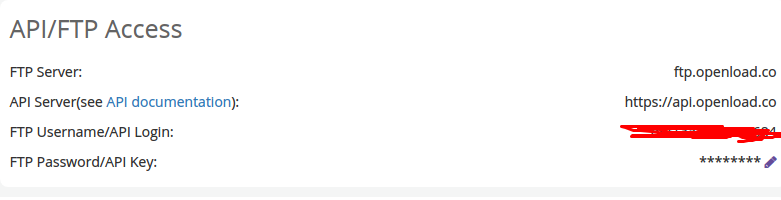
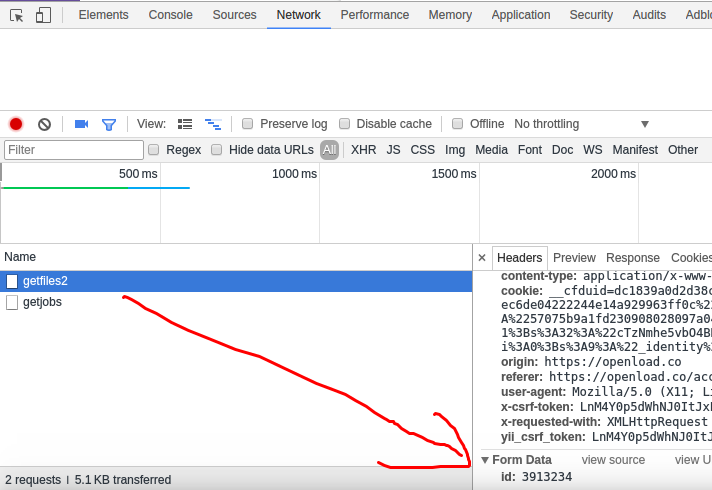
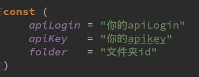
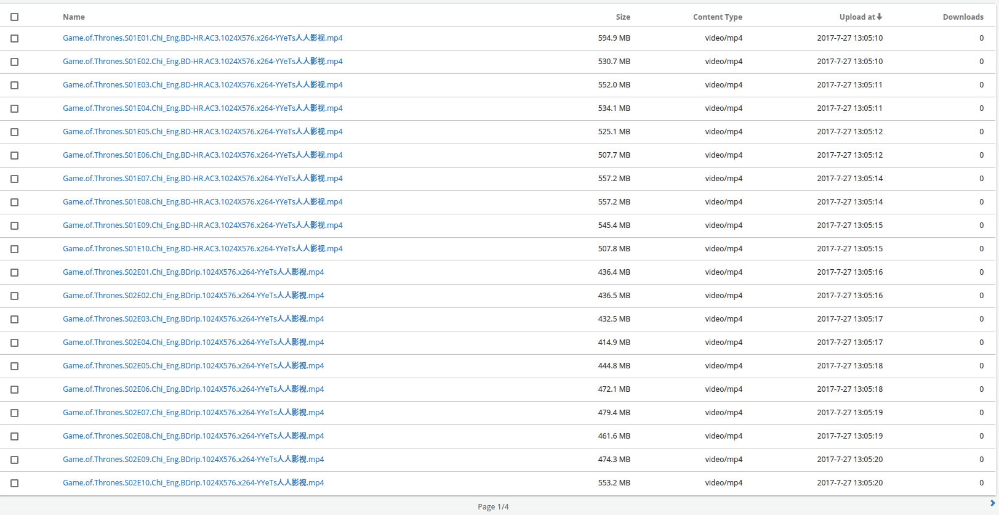

# 准备工作

首先需要去`openload.co`注册一个账号，访问较慢需要翻墙。然后登陆到后台记下你的api参数，查看apikey需要输入密码

然后新建一个文件夹，F12打开控制台，点击文件夹，可以看到文件夹id

好了，这三个参数搞定，可以运行代码了，两种方式自己选择

-   直接下载我已经编译好的版本，都在release文件夹下，没开携程

    -   如果开了携程，因为是抓取网页，可以并行运行速度快，但会导致上传后的列表没有顺序

    -   不开携程，速度慢，但上传后的列表是按剧集排序的

        （当然可以又快又有序，我不想写啊，目前只爬《权利的游戏》）

-   clone项目自己运行，需要安装[go环境](https://golang.org/)，然后修改`openload/openload.go` 中的参数，想开携程在`openload/gameOfThrones.go`中的`parseUrl(index, url)`前面加关键词`go`即可

    

### 注意事项

-   上传api每日限制100次，请确保你的网络良好，运行一次没成功的话需要去`openload.co`后台删掉已上传的等第二天吧

-   原理就是：爬取的本身就是openload已存在的资源链接，但通过别人的链接观看会弹一堆广告，所以通过爬取所有链接能秒传到自己的账号上，且没有广告～

-   抓取完后台应该有4页，每页默认20个，目前更新到第二集，所以最后一页应该有两集。

    